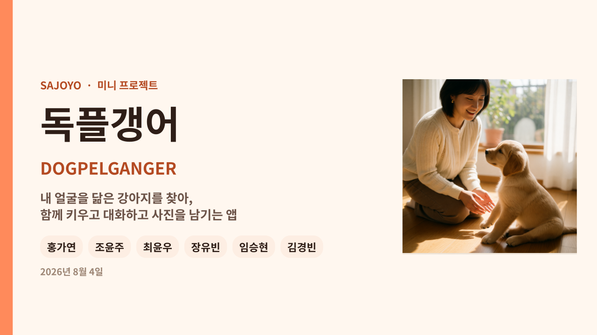
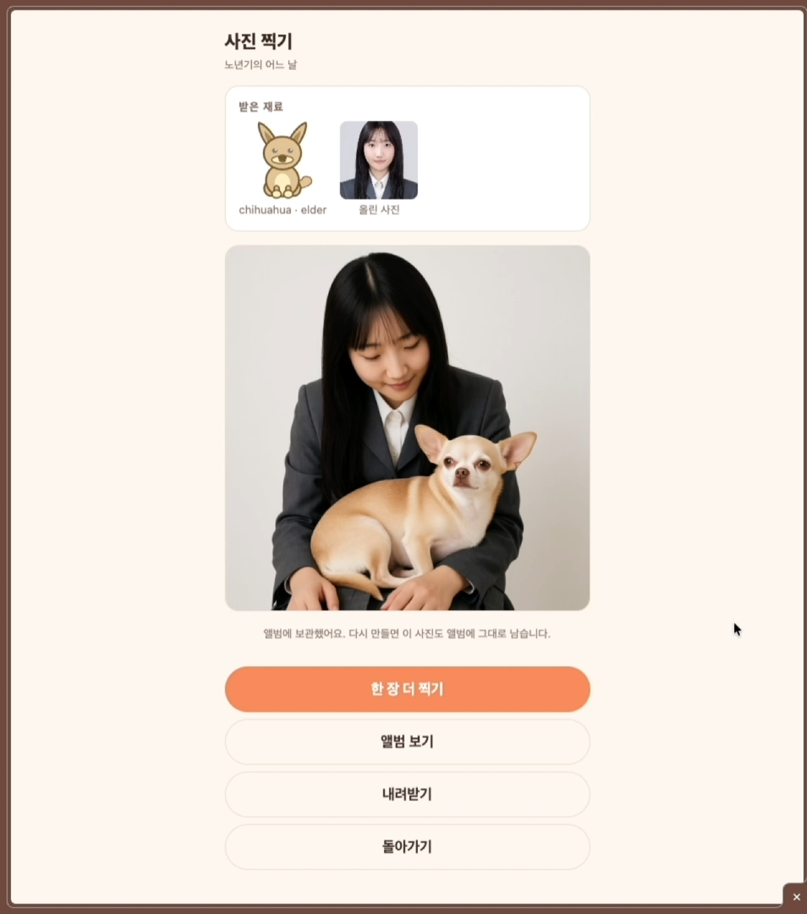
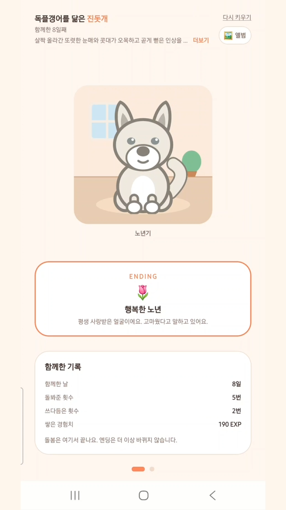

<div align="center">


# 독플갱어 🐾

**사진 한 장으로 나와 닮은 강아지를 찾아, 캐릭터로 키우고, 대화하고, 함께한 기념 사진까지 만드는 앱**

Expo SDK 57 · React Native · TypeScript · expo-router · ComfyUI · Gemini

</div>

---

## 소개

```
사진 올리기 → 닮은 품종 판정 → 캐릭터로 부화 → 돌보며 4단계 성장 → 대화
                                                  └→ 기념 사진 생성 → 앨범
```

얼굴 사진을 올리면 비전 모델이 **닮은 견종 조합**을 뽑습니다. 그 조합으로 캐릭터가
태어나고, 같은 조합에서 **성격**이 만들어져 대화할 때 그 성격으로 답합니다.
캐릭터를 돌보면 영유아기에서 노년기까지 자라고, 중간중간 **나와 캐릭터가 함께 있는
기념 사진**을 만들어 앨범에 모읍니다.

판정 → 캐릭터 → 성격 → 사진이 **전부 같은 견종 조합 하나에서 갈라져 나옵니다.**
네 사람이 각자 만든 기능이 한 흐름으로 이어지는 지점입니다.

## 시연 영상

[](https://drive.google.com/file/d/1WI4S5U381Li2evgK2KVrGdU-tJPgHBmD/view)

> 이미지를 누르면 시연 영상으로 이동합니다.

## 화면

|                                                |                                        |                                      |
| ---------------------------------------------- | -------------------------------------- | ------------------------------------ |
|       |  |    |
| 닮은 품종 판정                                 | 캐릭터 돌보기 · 4단계 성장             | 판정 결과로 만든 성격으로 대화       |
|  |     |  |
| 기념 사진 생성                                 | 단계별 앨범                            | 노년기 엔딩                          |

## 핵심 기능

| 기능           | 어떻게 만들었나                                                            | 담당           |
| -------------- | -------------------------------------------------------------------------- | -------------- |
| 닮은 동물 검색 | 비전 모델이 사진을 읽고 견종 혼합 비율을 뽑습니다                          | 홍가연         |
| 다마고치 육성  | 규칙 전부를 순수 함수로. 캐릭터는 이미지가 아니라 **SVG를 코드로 조합**    | 조윤주, 최윤우 |
| 성격 대화      | 견종 조합 → 성격 카드 → 시스템 프롬프트. 대화 요약을 서버에 눌러 담아 기억 | 장유빈, 임승현 |
| 기념 사진 생성 | 로컬 ComfyUI에 워크플로를 던지고, 앱은 진행 상태만 폴링                    | 김경빈         |

**캐릭터에 그림 파일이 하나도 없습니다.** 품종별 생김새와 단계별 비율을 코드가 조합해
**20종 × 4단계 = 80가지**를 SVG로 그립니다. 견종이 늘어도 에셋을 새로 그리지 않습니다.

## 동작 구조

```
                    ┌─────────────────────────────────────┐
   사진 ──────────► │  앱 (Expo · 웹 / 안드로이드)         │
                    │                                     │
                    │  src/lib/  ← 규칙과 배관이 여기      │
                    │    game.ts       순수 함수 게임 규칙 │
                    │    image.ts      플랫폼 차이 흡수     │
                    │    photo-job.tsx 화면 밖에서 폴링     │
                    └───┬─────────┬──────────┬──────────┬──┘
                        │         │          │          │
                   사진 판정     대화    사진 생성   대화 요약
                        ▼         ▼          ▼          ▼
                   Gemini 3.6  Gemini 3.1  ComfyUI    server/
                     Flash     Flash Lite            Node + node:sqlite
```

- **게임 규칙은 전부 순수 함수**입니다(`src/lib/game.ts`). 화면 없이 터미널에서 테스트할 수 있습니다.
- **플랫폼이 갈리는 코드는 `src/lib/` 안에 가둡니다.** 화면은 웹인지 폰인지 몰라도 됩니다.
- **외부 의존은 전부 선택적**입니다. ComfyUI나 대화 서버를 안 띄워도 앱은 그대로 돕니다.

## 기술 스택

| 영역   | 사용                                                         |
| ------ | ------------------------------------------------------------ |
| 앱     | Expo SDK 57 · React Native 0.86 · React 19 · TypeScript      |
| 라우팅 | expo-router (파일 하나 = 경로 하나)                          |
| 그래픽 | react-native-svg · Reanimated (캐릭터를 코드로 조합)         |
| AI     | Gemini 3.6 Flash (견종 판정) · 3.1 Flash Lite (성격 대화)    |
| 사진   | ComfyUI (로컬 GPU) — 앱은 워크플로를 던지고 진행 상태만 폴링 |
| 서버   | Node + `node:sqlite` (대화 요약 저장, 선택)                  |
| 배포   | EAS 클라우드 빌드 → 안드로이드 APK                           |

## 팀

| 담당           | 기능                                 |
| -------------- | ------------------------------------ |
| 홍가연         | 닮은 동물 검색                       |
| 조윤주, 최윤우 | 다마고치 게임 (캐릭터화 + 게임 동작) |
| 장유빈, 임승현 | 동물과 대화하기 (페르소나)           |
| 김경빈         | 사진 만들어 공유하기                 |

## 실행해 보기

```bash
npm ci
npm run web
```

Node **v20.19.4 이상**이 필요합니다. AI 기능을 쓰려면 `.env.example` 을 `.env` 로
복사해 키를 채우세요 — 비워둬도 앱은 뜹니다.

## 문서

| 문서                                                     | 내용                                          |
| -------------------------------------------------------- | --------------------------------------------- |
| [DEVELOPMENT.md](./DEVELOPMENT.md)                       | 설치 · 폴더 구조 · 게임 규칙 · ComfyUI · 배포 |
| [docs/engineering-notes.md](./docs/engineering-notes.md) | 만들면서 푼 문제와 설계 결정                  |
| [CONTRIBUTING.md](./CONTRIBUTING.md)                     | 이슈 · 브랜치 · 커밋 · PR 규칙                |
